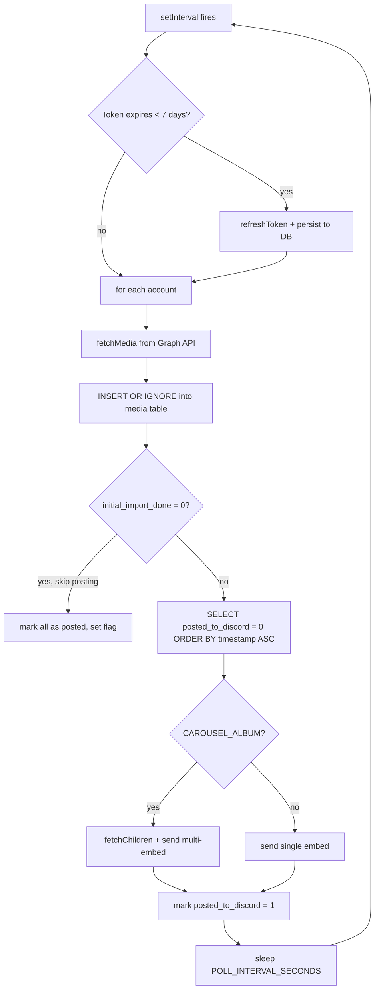

# Architecture

## Design Decisions

**Flat module layout** — this is a single-process polling service with < 1000 lines of code.
No service layers, DI containers, or repository patterns. One file per responsibility under `src/`.

**Polling via `setInterval`** — simple and sufficient. No `node-cron` overhead for a service
that polls on a fixed interval. Shutdown is handled via `AbortController`.

**Discord webhook, not discord.js** — the bot never connects to Discord's Gateway. A plain
HTTPS webhook POST (via native `fetch`) is all that's needed.

**`better-sqlite3` (synchronous SQLite)** — a single-process poller has no concurrent readers;
synchronous access removes connection-pool complexity.

**`zod` config validation** — the process fails at startup if any required ENV var is missing
or malformed. No silent misconfigurations at runtime.

## Module Map

| File | Responsibility |
|---|---|
| `src/config.ts` | Parse + validate ENV vars via zod; export typed `Config` |
| `src/logger.ts` | Shared `pino` logger instance |
| `src/db.ts` | SQLite init (WAL mode), schema migration, prepared statements |
| `src/graph-api.ts` | Instagram Graph API client: `fetchMedia`, `resolveUsername`, `refreshToken` |
| `src/discord.ts` | Embed builder + Webhook POST (single + carousel) |
| `src/poller.ts` | Polling loop: fetch → diff → save → post; token-refresh check |
| `src/index.ts` | Bootstrap: config → db → poller; SIGTERM/SIGINT graceful shutdown |

## Poll Loop (simplified)

