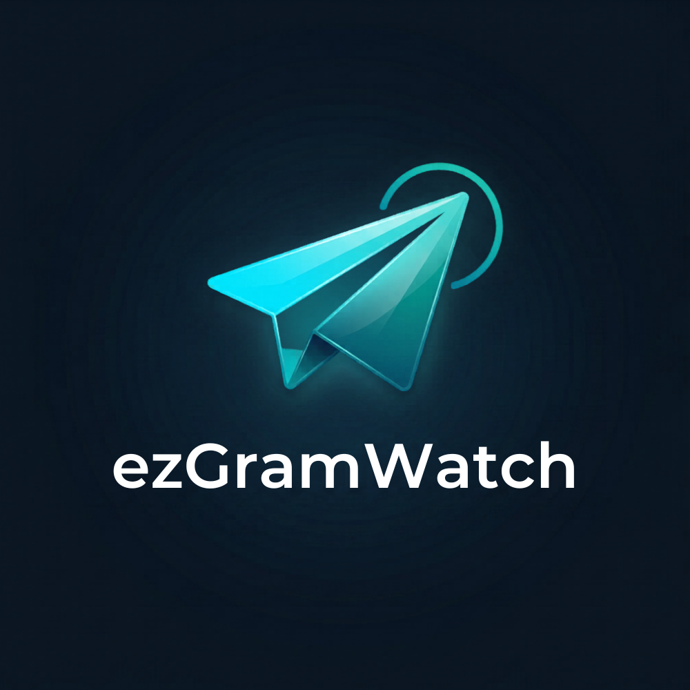

<div align="center">
  

  [](https://github.com/slgfire/ezgramwatch/actions/workflows/build.yml)
  [](https://github.com/slgfire/ezgramwatch/actions/workflows/docker.yml)
  [](https://github.com/slgfire/ezgramwatch/releases)
  [](LICENSE)

  **🔔 Automatically forwards your Instagram Business posts and Reels to Discord via the official Meta Graph API — no scraping, fully ToS-compliant**
</div>

---

> **Heads up:** This bot only works with Instagram accounts **you own** and have connected to a Meta Developer App. Monitoring other people's profiles is not possible through the official API.

## Features

- 📸 Detects new **posts, videos, and Reels** on a configurable polling interval
- 🖼️ **Carousel albums** are sent as a multi-image Discord gallery (up to 10 images per message)
- 🔇 **Silent first run** — existing posts are imported without flooding Discord
- 🔑 **Automatic token refresh** 7 days before expiry (requires Meta App credentials)
- 🗃️ SQLite-backed deduplication — no duplicate posts after restarts
- 🐳 Single Docker Compose command to run

## Prerequisites

Before you start, you'll need:

- A **Meta Developer account** — [developers.facebook.com](https://developers.facebook.com)
- An **Instagram Business or Creator account** linked to a Facebook Page
- A **Discord server** where you have permission to create Webhooks
- **Docker** and **Docker Compose** installed on your server

---

## Setup Guide

### Step 1 — Create a Discord Webhook

1. Open your Discord server and go to the channel where posts should appear.
2. Click the **gear icon ⚙️** next to the channel name → **Integrations** → **Webhooks**.
3. Click **New Webhook**, give it a name (e.g. `ezgramwatch`), and optionally set an avatar.
4. Click **Copy Webhook URL**.

Save this URL — you'll need it as `DISCORD_WEBHOOK_URL`.

---

### Step 2 — Create a Meta Developer App

1. Go to [developers.facebook.com](https://developers.facebook.com) and sign in.
2. Click **My Apps** → **Create App**.
3. Choose **Business** as the app type, give it a name, and confirm.
4. On the App Dashboard, click **Add Product** and add **Instagram Graph API**.

> **App Mode:** Your app starts in Development mode. This is fine for personal use — you can connect your own account as a Tester without going through App Review.

---

### Step 3 — Connect your Instagram account

1. In the App Dashboard, go to **Instagram Graph API → Settings**.
2. Click **Add Instagram Tester** and enter your Instagram username.
3. Open Instagram on your phone → **Settings → Apps and Websites → Tester Invites** → Accept the invitation.

Your Instagram account is now linked to the app.

---

### Step 4 — Get a Long-Lived Access Token

#### 4a. Generate a short-lived token in Graph API Explorer

1. Open the [Graph API Explorer](https://developers.facebook.com/tools/explorer).
2. Select your app from the top-right dropdown.
3. Click **Generate Access Token**.
4. In the permission dialog, make sure both of these are checked:
   - `instagram_basic`
   - `pages_read_engagement`
5. Click **Generate Access Token** and confirm in the popup. Copy the token shown.

The token from the Explorer is valid for only **1 hour**. Exchange it for a 60-day token in the next step.

#### 4b. Exchange for a long-lived token

Run the following `curl` command, replacing the placeholders with your values:

```bash
curl "https://graph.facebook.com/oauth/access_token\
?grant_type=fb_exchange_token\
&client_id=YOUR_APP_ID\
&client_secret=YOUR_APP_SECRET\
&fb_exchange_token=YOUR_SHORT_LIVED_TOKEN"
```

You'll find your **App ID** and **App Secret** in the App Dashboard under **Settings → Basic**.

The response looks like this:

```json
{
  "access_token": "EAABsb...",
  "token_type": "bearer",
  "expires_in": 5183944
}
```

Copy the `access_token` value — this is your `INSTAGRAM_ACCESS_TOKEN`. It's valid for ~60 days.

> **Tip:** To avoid manually renewing every 60 days, set `META_APP_ID` and `META_APP_SECRET` in your `.env`. The bot will auto-refresh the token when it has fewer than 7 days remaining.

---

### Step 5 — Find your Instagram User ID

You need the numeric ID of your Instagram Business account (not your username).

1. In the [Graph API Explorer](https://developers.facebook.com/tools/explorer), make sure your long-lived token is pasted in the **Access Token** field.
2. In the query field, type `me/accounts` and click **Submit**. You'll get a list of Facebook Pages — note the `id` of your page.
3. Now type `/<your_page_id>?fields=instagram_business_account` and click **Submit**:

```json
{
  "instagram_business_account": {
    "id": "17841400000000001"
  },
  "id": "123456789012345"
}
```

The number inside `instagram_business_account.id` is your Instagram User ID.

Use it in `INSTAGRAM_ACCOUNTS` like this:
```
INSTAGRAM_ACCOUNTS=17841400000000001:mychannel
```

The `:mychannel` part is an optional display alias shown in the logs. If omitted, the bot fetches your actual username from the API.

---

### Step 6 — Configure and run

```bash
git clone https://github.com/slgfire/ezgramwatch
cd ezgramwatch
cp .env.example .env
```

Open `.env` and fill in the required values:

```env
DISCORD_WEBHOOK_URL=https://discord.com/api/webhooks/...
INSTAGRAM_ACCESS_TOKEN=EAABsb...
INSTAGRAM_ACCOUNTS=17841400000000001:myaccount

# Optional but recommended — enables auto token refresh
META_APP_ID=123456789
META_APP_SECRET=abc123...
```

Then start the bot:

```bash
mkdir -p data
docker compose up -d
docker compose logs -f
```

On first start you'll see something like:

```
{"msg":"poll.account","fetched":12,"new":12,"posted":0}
```

All existing posts are silently imported. Only new posts from this point on will be forwarded to Discord.

---

## Configuration Reference

| Variable | Required | Default | Description |
|---|---|---|---|
| `DISCORD_WEBHOOK_URL` | ✅ | — | Full Discord Webhook URL |
| `INSTAGRAM_ACCESS_TOKEN` | ✅ | — | Long-lived User Access Token (bootstrap) |
| `INSTAGRAM_ACCOUNTS` | ✅ | — | `<ig_user_id>[:<alias>],…` comma-separated |
| `META_APP_ID` | — | — | Meta App ID — enables auto token refresh |
| `META_APP_SECRET` | — | — | Meta App Secret — enables auto token refresh |
| `POLL_INTERVAL_SECONDS` | — | `300` | How often to check for new posts (seconds) |
| `POST_EXISTING_ON_FIRST_RUN` | — | `false` | Set `true` to post up to `FIRST_RUN_POST_LIMIT` existing posts on first start |
| `FIRST_RUN_POST_LIMIT` | — | `10` | Max posts sent when `POST_EXISTING_ON_FIRST_RUN=true` |
| `CAPTION_PREVIEW_CHARS` | — | `300` | Characters of caption shown in the embed |
| `MEDIA_FETCH_LIMIT` | — | `25` | Items fetched per poll (max 100) |
| `LOG_LEVEL` | — | `info` | Log level: `trace` `debug` `info` `warn` `error` |
| `DATABASE_PATH` | — | `/data/bot.sqlite` | SQLite path inside the container |
| `GRAPH_API_VERSION` | — | `v21.0` | Meta Graph API version |

### Monitoring multiple accounts

Separate accounts with commas:

```env
INSTAGRAM_ACCOUNTS=17841400000000001:brand,17841400000000002:personal
```

---

## Volume & Permissions

The container runs as the `node` user (uid=1000). Make sure the `./data` directory is writable:

```bash
sudo chown -R 1000:1000 ./data
```

The SQLite database in `./data` persists across container restarts and image updates.

---

## Updating

```bash
docker compose pull
docker compose up -d
```

---

## Known Limitations

- **Own accounts only** — the Graph API does not provide access to third-party profiles.
- **Stories not supported** — they use a separate endpoint with a 24-hour lifetime and are out of scope.
- **60-day token expiry** — configure `META_APP_ID` + `META_APP_SECRET` for automatic renewal.
- **Rate limits** — 200 API calls/hour (Standard tier). With the default `POLL_INTERVAL_SECONDS=300` and a small number of accounts this is not an issue.

See [`.ai/API_LIMITATIONS.md`](.ai/API_LIMITATIONS.md) for the full list.

---

## License

MIT — see [LICENSE](LICENSE).
